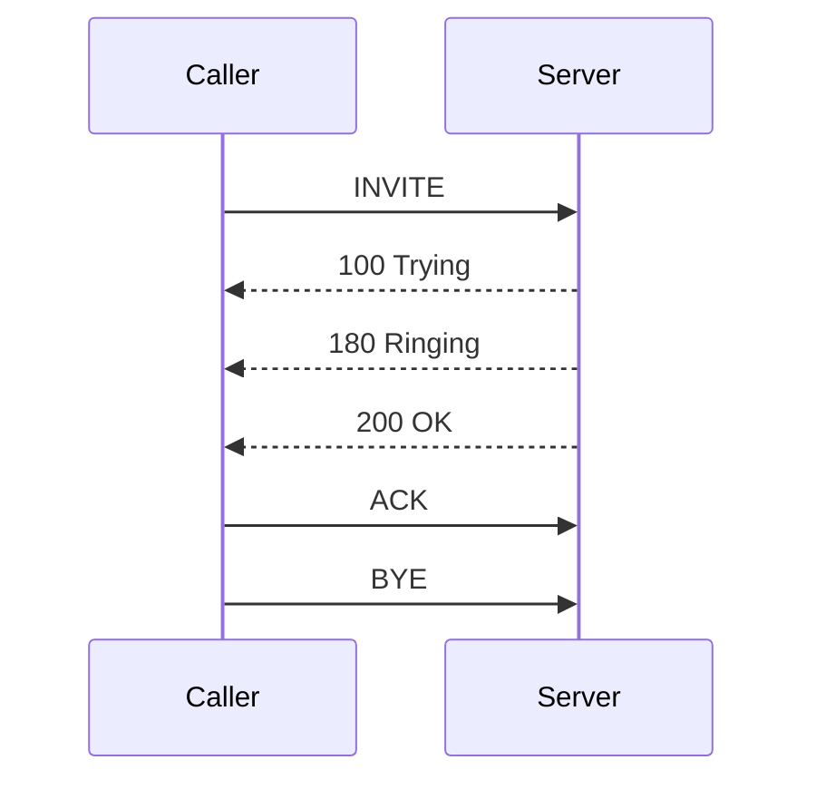

# 📞 SIP Call Visualizer

Convert raw SIP messages into **clear, readable call flows** and **Mermaid sequence diagrams**.

Designed for debugging, learning, and analyzing VoIP/SIP call behavior.

---

## 🚀 Demo Output

### Input (SIP Messages)

```text
INVITE sip:user@domain.com SIP/2.0
100 Trying
180 Ringing
200 OK
ACK
BYE
```

### Output (Call Flow)

```text
Caller → Server: INVITE
Server → Caller: 100 Trying
Server → Caller: 180 Ringing
Server → Caller: 200 OK
Caller → Server: ACK
Caller → Server: BYE
```

### 📊 Mermaid Diagram



---

## ⚡ Features

* 🔍 Parse SIP messages into structured call flow
* 📊 Generate Mermaid sequence diagrams
* 📞 Supports common SIP flows:

  * Basic call
  * Call establishment & teardown
* 🧩 Easy to extend for custom SIP scenarios

---

## 🛠️ Installation

```bash
git clone https://github.com/vox-zen/sip-call-visualizer.git
cd sip-call-visualizer
pip install -r requirements.txt
```

---

## ▶️ Usage

```bash
python visualizer/sip_visualizer.py input.txt
```

Or use sample:

```bash
python visualizer/sip_visualizer.py samples/basic_call.txt
```

---

## 📁 Project Structure

```bash
visualizer/        # Core parsing & visualization logic
scripts/           # Utility scripts
docs/              # Documentation & examples
samples/           # Example SIP traces
```

---

## 🎯 Use Cases

* Debug SIP call flows
* Analyze VoIP signaling issues
* Learn how SIP communication works
* Visualize logs from:

  * Asterisk
  * FreeSWITCH
  * SIP Trunks

---

## 🔮 Roadmap

* [ ] Parse raw SIP logs (Wireshark export)
* [ ] Export diagrams as PNG/SVG
* [ ] Web UI (upload SIP logs → visualize)
* [ ] Real-time call tracing

---

## 💡 Example Workflow

1. Capture SIP logs (Asterisk / tcpdump / Wireshark)
2. Feed into this tool
3. Get readable flow + diagram
4. Debug faster 🚀

---

## 👤 Author

**Vizi**
Full-Stack Developer (Communication Tools Focus)

---

## ⭐ Support

If this project helps you, consider giving it a ⭐ on GitHub!
